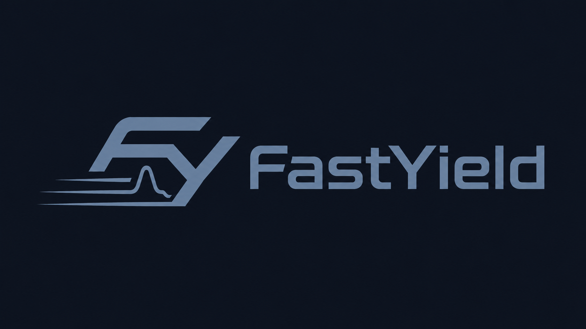
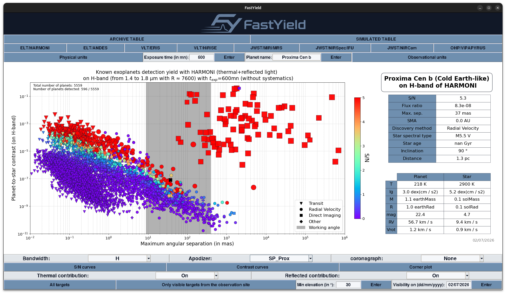

<p align="center">
  <picture>
    <source media="(prefers-color-scheme: dark)" srcset="src/fastyield/FastYield_logo.png">
    
  </picture>
</p>

# FastYield

**FastYield** is a Python package for estimating exoplanet detection performances with high-contrast imaging combined with medium- to high-resolution spectroscopy, with a particular focus on the **molecular mapping** technique.

FastYield is an extended version of [FastCurves](https://github.com/ABidot/FastCurves). FastCurves estimates detection limits from instrumental properties such as PSF profiles, transmission, detector characteristics, background, and spectral resolution, together with planetary properties such as magnitude, temperature, surface gravity, and albedo. It can also provide retrieval-performance estimates through corner plots.

FastYield builds on this framework by applying the FastCurves formalism to archival or synthetic planet catalogs. It can therefore be used to estimate the expected **detection yield** of a given instrument, survey, or observing configuration.

The molecular mapping approach relies on stellar-halo subtraction through spectral high-pass filtering, followed by cross-correlation with planetary atmospheric templates. This makes it particularly efficient at reducing low-frequency stellar and speckle residuals while exploiting the high-frequency molecular signatures of exoplanet spectra.

For more details, see:

* [Bidot et al. 2024](https://www.aanda.org/articles/aa/pdf/2024/02/aa46185-23.pdf)
* [Martos et al. 2025](https://arxiv.org/pdf/2504.06890)

<p align="center">
  <picture>
    <source media="(prefers-color-scheme: dark)" srcset="FastYield_
example.png">
    
  </picture>
</p>

---

## Instruments currently included

FastYield currently includes configurations for the following instruments:

* **ELT/HARMONI**
* **ELT/ANDES**
* **VLT/ERIS**
* **VLT/HiRISE**
* **VLT/CRIRES+**
* **JWST/MIRI-MRS**
* **JWST/NIRSpec IFU**
* **JWST/NIRCam**
* **OHP/VIPAPYRUS**

---

## Installation

FastYield can be installed directly from GitHub with `pip`.

### Standard installation

Use this option if you only want to use FastYield:

```bash
python -m pip install git+https://github.com/StevMartos/FastYield.git
```

This installs FastYield and its required dependencies.

To force `pip` to upgrade FastYield and all compatible dependencies to their latest available versions, use:

```bash
python -m pip install --upgrade --upgrade-strategy eager git+https://github.com/StevMartos/FastYield.git
```

You can then test the installation with:

```bash
python -c "import fastyield; print(fastyield.__version__)"
python -c "from fastyield.FastCurves import FastCurves; print(FastCurves)"
python -c "from fastyield.FastYield_interface import FastYield_interface; print(FastYield_interface)"
```

### Development installation

Use this option if you want to modify the code locally:

```bash
git clone https://github.com/StevMartos/FastYield.git
cd FastYield
python -m pip install -e ".[dev]"
```

In development mode, changes made directly inside the local repository are immediately reflected in the installed package.

If you modify package metadata or dependencies in `pyproject.toml`, reinstall the package with:

```bash
python -m pip install -e ".[dev]"
```

To force an update of FastYield and all compatible dependencies during a development installation, use:

```bash
python -m pip install --upgrade --upgrade-strategy eager -e ".[dev]"
```

---

## Dependencies

FastYield dependencies are automatically installed from `pyproject.toml`.

FastYield mainly relies on:

* [NumPy](https://numpy.org/)
* [SciPy](https://scipy.org/)
* [Astropy](https://www.astropy.org/)
* [Matplotlib](https://matplotlib.org/)
* [Pandas](https://pandas.pydata.org/)
* [tqdm](https://tqdm.github.io/)
* [Numba](https://numba.pydata.org/)
* [scikit-learn](https://scikit-learn.org/)
* [statsmodels](https://www.statsmodels.org/)
* [corner](https://corner.readthedocs.io/)
* [ttkwidgets](https://github.com/TkinterEP/ttkwidgets)
* [timezonefinder](https://github.com/jannikmi/timezonefinder)
* [pytz](https://pythonhosted.org/pytz/)
* [dace-query](https://dace-query.readthedocs.io/)

Development tools such as `pytest`, `ruff`, `build`, and `twine` are not required to use FastYield. They are only installed when using the development option:

```bash
python -m pip install -e ".[dev]"
```

---

## External data

FastYield requires an external `sim_data/` directory for most S/N, contrast, and yield calculations.

This directory contains the instrumental data, simulation data, and spectral library used by the package. The Python package itself contains the code, while the large scientific data files are distributed separately.

The `sim_data/` directory can be downloaded here:

[Download the sim_data directory](https://filesender.renater.fr/?s=download&token=8a2acaeb-5d47-457c-8ef2-425aeca1279f)

After downloading and extracting the archive, you should have a directory named:

```text
sim_data/
```

The expected structure is:

```text
sim_data/
├── Archive_table/
├── Background/
├── PCS/
├── PSF/
├── R_corr/
├── Simulated_table/
├── Spectra/
    ├── planet_spectrum/
    ├── star_spectrum/
    └── molecular/
├── Systematics/
└── Transmission/
```

---

## Setting the sim_data path

FastYield needs to know where the external `sim_data/` directory is located on your machine.

There are two possible ways to define this path.

### Option 1 — Recommended: environment variable

This is the recommended solution if you want FastYield to automatically find your `sim_data/` directory every time you use it.

On Linux or macOS, add the following line to your `~/.bashrc`, `~/.zshrc`, or equivalent shell configuration file:

```bash
export FASTYIELD_SIM_DATA_PATH="/path/to/sim_data"
```

Then reload your shell configuration:

```bash
source ~/.bashrc
```

You can check that the path has been correctly defined with:

```bash
echo $FASTYIELD_SIM_DATA_PATH
```

### Option 2 — Set the path from Python

You can also define the path directly in your Python script:

```python
from fastyield.config import set_sim_data_path

set_sim_data_path("/path/to/sim_data")
```

For example:

```python
from fastyield.config import set_sim_data_path

set_sim_data_path("/home/user/data/FastYield/sim_data")
```

This should be done before running any FastYield function that needs instrumental data, simulation data, or spectra.

---

## Path priority

FastYield searches for the `sim_data/` directory in the following order:

1. the path defined with `set_sim_data_path("/path/to/sim_data")`;
2. the `FASTYIELD_SIM_DATA_PATH` environment variable;
3. the default local path `sim_data/`, useful when working from a local clone of the repository.

This means that users can either keep `sim_data/` inside a local clone of the repository or store it elsewhere on their machine.

---

## Quick start

Example of a minimal Python setup:

```python
from fastyield.config import set_sim_data_path
from fastyield.spectrum import load_planet_spectrum
from fastyield.FastYield_interface import FastYield_interface

# Required if FASTYIELD_SIM_DATA_PATH is not defined:
# set the path to your local FastYield sim_data directory.
# This directory should contain the instrumental/simulation data folders
# and the Spectra/ directory.
set_sim_data_path("/path/to/sim_data")

# Test the data path by loading a planetary spectrum.
planet_spectrum = load_planet_spectrum(
    T_planet=1000,
    lg_planet=4.0,
    model="BT-Settl",
)

# Open the FastYield graphical interface.
FastYield_interface()
```

If you have already defined the environment variable `FASTYIELD_SIM_DATA_PATH`, then the call to `set_sim_data_path()` is not required.

---

## Adding a new instrument

If you would like to add a new instrument to FastYield, please contact:

[steven.martos@univ-grenoble-alpes.fr](mailto:steven.martos@univ-grenoble-alpes.fr)

Please include, when available:

* spectral range and spectral resolution for each band;
* total system transmission, excluding tellurics, for each band;
* representative PSF, either as a 2D image or a 3D spectral cube;
* expected background flux;
* expected read-out noise;
* expected dark current;
* effective spatial sampling;
* detector saturation limit;
* coronagraphic and/or apodizer transmission, if relevant.

---

## WP7 / PCS usage

A dedicated script is provided for users involved in the PCS Working Package 7 activities:

```text
PCS_FastYield.py
```

This script provides a practical FastYield-based framework for exploring the expected detection performance of ELT/PCS-like instrumental configurations. It connects PCS instrumental assumptions, high-contrast imaging inputs, stellar and planetary spectral models, detector assumptions, and the FastYield population-level formalism in order to estimate signal-to-noise ratios and detection probabilities over a multidimensional instrumental design grid.

In practice, `PCS_FastYield.py` can be used to explore how the expected detection yield depends on parameters such as spectral resolution, central wavelength, bandwidth, wavefront error, inner working angle, instrumental transmission, residual systematic or speckle modulation level, and field of view. The script includes both IFU-like and imager-like observing configurations, and can be used to compare differential imaging and molecular mapping regimes in a common framework.

A detailed methodology note is included with the package:

```text
PCS_FastYield.pdf
```

This note explains the assumptions and calculations implemented in `PCS_FastYield.py`, including the PCS instrumental inputs, the adopted planet catalog, the spectral prescriptions, the throughput and background budgets, the DI and MM formalisms, the treatment of systematic and speckle residuals, and the construction of the final detection-probability grids.

Users interested in modifying the PCS assumptions or contributing new instrumental inputs are encouraged to read this note first, since it provides the reference description of the current implementation.

---

## References

If you use FastYield or FastCurves in your work, please cite:

* Bidot et al. 2024, *FastCurves: a performance estimation tool for molecular mapping*, A&A.
* Martos et al. 2025, *Combining high-contrast imaging and high-resolution spectroscopy: MIRI/MRS on-sky results compared to expectations*, A&A.

---

## Contact

For questions, bug reports, or instrument additions, please contact:

[steven.martos@univ-grenoble-alpes.fr](mailto:steven.martos@univ-grenoble-alpes.fr)


